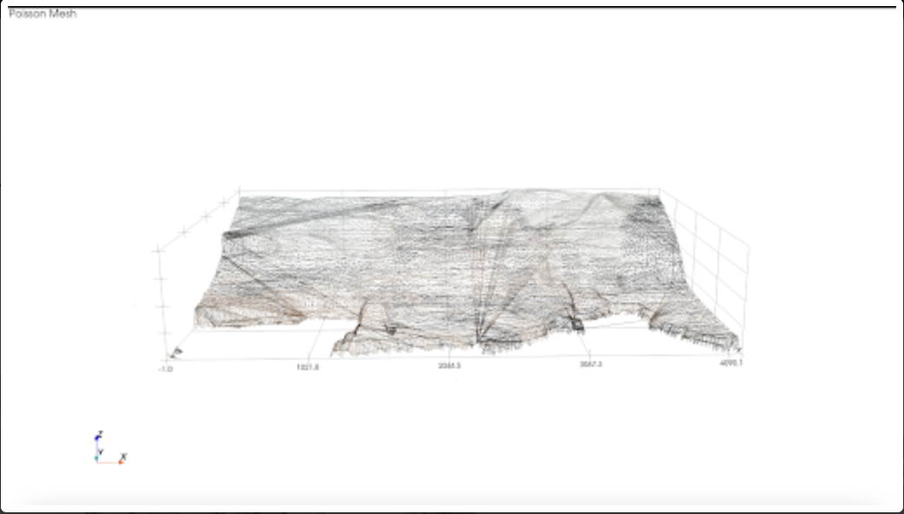

# Snap2Save: Disaster Response with 3D Intelligence

> Combining image-based 3D reconstruction and risk-aware pathfinding to guide emergency responders through disaster zones safely and efficiently.

##  Overview

In natural disasters, every minute counts. Up to **30% of disaster-related fatalities** occur after the initial impact, often due to:

- Collapsed or unstable buildings
- Inaccessible or poorly mapped terrain
- Lack of updated visual or spatial data

**Snap2Save** is a web-based tool that enables:

1. **Real-time 3D building reconstruction** using only a smartphone image
2. **Risk-aware routing** using live hazard data and optimized pathfinding

All it takes is a picture and coordinates. Rescuers gain visibility into unsafe buildings and find safer routes in real time.

##  Features

### 1. 3D Image Rendering (From 2D)

Snap2Save uses pretrained depth estimation models (MiDaS + DPT) to reconstruct disaster-damaged buildings into interactive 3D structures.

- **Input:** A single RGB photo
- **Output:** Mesh rendering of structure using:
  - [R, G, B, relative_depth] encoding
  - Point cloud + Poisson surface reconstruction
  - Visualization with Open3D or Three.js

> This allows teams to view buildings spatially before entering, even without a blueprint.

---

### 2. Risk-Aware Shortest Path Routing

We calculate routes that prioritize safety, not just distance.

- Live data from **Google Maps API**, NASA FIRMS, and tornado/fire alerts
- Compute **risk scores** along path segments
- Render colored routes using **Folium** (Python)
- Combine distance + danger heuristics to guide pathfinding

> Routes are color-coded by danger level and adjust dynamically to real-time alerts.

## Before & After: 3D Rendering in Action

###  Input Photo

This collapsed building image is the only input required:

---

### Output Mesh

| Textured 3D Mesh                        | Wireframe View (Poisson Mesh)           |
|----------------------------------------|------------------------------------------|
|  |  |

> From one photo, we recreate structure, orientation, and key layout details.

## Tech Stack

| Component        | Technologies Used                              |
|------------------|--------------------------------------------------|
| 3D Reconstruction | MiDaS, DPT, Open3D, Three.js                    |
| Routing Engine    | Google Maps API, Folium, hazard data overlays   |
| Frontend          | React.js, TypeScript                           |
| Backend           | Flask, Streamlit, PyTorch                      |

---

## Full Workflow

1. Upload a disaster image + GPS coordinates
2. Backend generates 3D point cloud → mesh → renders output
3. Routing engine finds safest path from rescuer to structure
4. Rescuers use interactive tools to plan safe, informed entry

## Known Limitations

- Currently supports **building exteriors only**
- Small demo dataset (~30 disaster images)
- No indoor point cloud or LiDAR support (yet)

## Next Steps

- Incorporate **interior scans** from drones or robotic imaging
- Instead of a single image we use numerous images from different angles and recreat the target object.
- Add **terrain elevation data** + building material estimation
- Expand dataset and multilingual support

